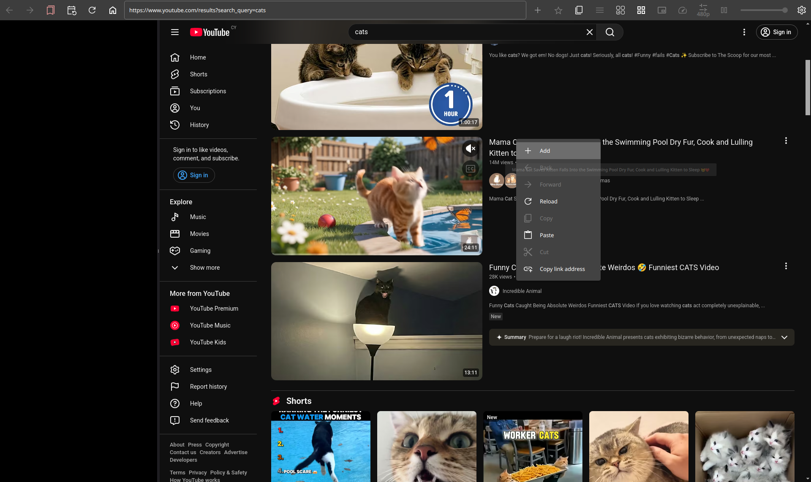
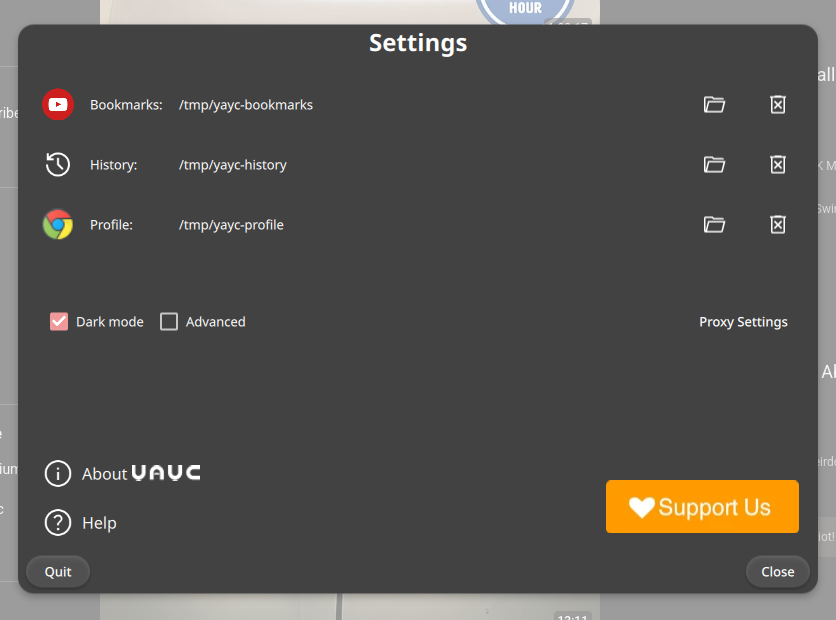
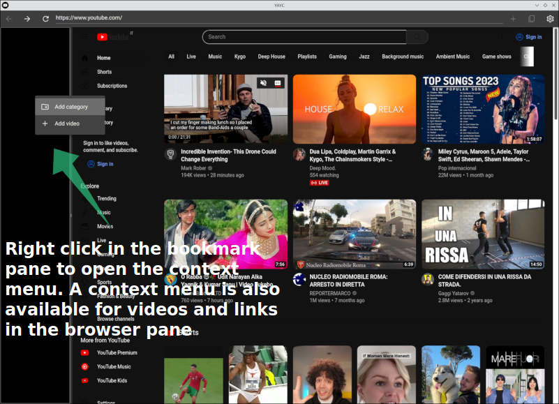
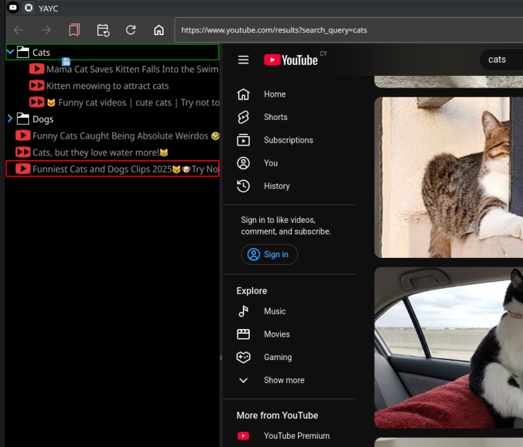

# YAYC : Yet Another YouTube Client


[](https://github.com/yayc-stream/yayc/blob/master/LICENSE)
[](https://github.com/yayc-stream/yayc/releases)
[](https://GitHub.com/yayc-stream/yayc/releases/)

A YouTube client built with Qt5/QML.
It sports bookmarks support, progress tracking, and more.
It is intended to help managing video queues and playlists, sparing the user from having
to use many browser tabs or windows to keep track of multiple content.

## Dependencies

- `QtCore`
- `QtNetwork`
- `QtWidgets`
- `QtQuick`
- `QtQuickControls1`
- `QtQuickControls2`
- `QtWebEngine`
- `QtWebChannel`
- `OpenSSL`

## Build instructions

### Provisioning

#### Windows

Building YAYC on Windows requires Qt5 and Visual Studio 2019 (optionally QtCreator).
Visual Studio 2019 (community) can be obtained for free from Microsoft (https://visualstudio.microsoft.com/vs/older-downloads/)
Latest version of Qt5 (5.15) can be installed through the Qt online installer (https://www.qt.io/download-qt-installer).
Remember to select OpenSSL 1.1.1 from the Qt online installer.

**UPDATE:** Starting summer 2024, QtWebEngine shipped with Qt 5.15.2 (last official Qt5 opensource release) is not able to run the youtube embedded player anymore. 
At the same time, it seemingly is the only Qt5 release for windows able to properly deploy with windeployqt. 
Therefore, for the time being, we are unable to provide an updated binary release package for Windows.
A working solution is to use Microsoft *vcpkg* and vcpkg Qt5 package to build and run YAYC. 
Unfortunatly, vcpkg Qt5 package also seemingly has a broken windeployqt setup, and so it cannot be used to produce a binary YAYC windows release.

#### Linux

Building YAYC on linux requires Qt5 and a gcc compiler toolchain.
On debian-based distributions the c++ toolchain can usually be installed with
```
apt install build-essential
```

Qt5 can be obtained through the Qt online installer (see above) or through your linux distribution package manager.
On debian-based distributions (ubuntu, mint, etc.) for example:
```
apt install libqt5webchannel5-dev libqt5webengine5 qtwebengine5-dev qtwebengine5-private-dev qtwebengine5-dev-tools libqt5webengine-data libqt5websockets5-dev libqt5network5 libqt5quickcontrols2-5 qml-module-qtquick-controls qml-module-qtquick-controls2 qml-module-qtquick2 qml-module-qtwebengine qml-module-qtwebchannel qtquickcontrols2-5-dev qml-module-qt-labs-platform qml-module-qt-labs-settings qml-module-qtquick-dialogs openssl
```
Note: OpenSSL 1.1 needs to be available and properly linked to the Qt5 installation.
This should be not a problem with distribution packages, but it may be with installer-based Linux installations.


### Building

```
qmake CONFIG+=release
make
```

## Releases

For the time being we provide a portable Win32 build.
We will not provide pre-built AppImage packages for Linux distributions as this technology proved to be insufficient when it comes to shipping QtWebEngine and OpenSSL based applications.
If you are using a Linux OS, we encourage you to try building YAYC on your system, since modern distributions should provide all the necessary Qt 5.15 libraries, and YAYC is expected to be relatively easy to build (see above).
We are currently working on creating macOS binary distribution packages.

## Usage

```
# yayc
```

Notes: 
- If no bookmarks directory is specified, bookmarks won't be saved.
- If no history directory is specified, history won't be saved.
- If no Google profile directory is specified, YAYC will operate in Inkognito mode, and logging into your Google account won't be remembered at next app restart.




 



